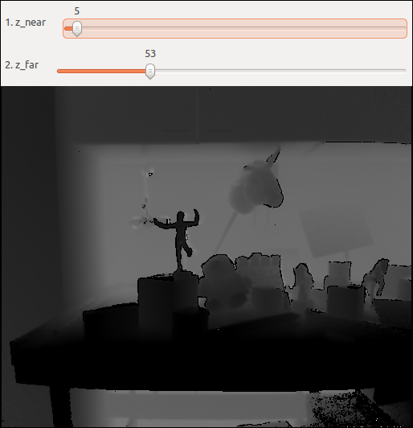

# misc/view_depth

Small GUI to visualize depth maps, with sliders to adjust visible range.

## Usage

    misc/view_depth depth.png [z_near] [z_far] [out_visualization.png]
    
`depth.png` must be a single channel, 8 or 16 bit image file (PNG or another file format), non-normalized depth values.
For example the raw depth images captured by Kinect. If `out_visualization.png` is passed, the program stores a
visualization into this file. Otherwise, it displays a window with the visualization and sliders to adjust the range.
`z_near` and `z_far` are the range of values to be visualized.

## Description

The GUI looks like this:

Adjusting the sliders changes the visualized image in real time. Depending on the platform and/or version of OpenCV,
numbers may be shown on the sliders (as in this screenshot). They are meaningless. The actual `z_near` and `z_far`
values are shown on the command line output as the sliders get adjusted. 

Pixels with values lower of equal to `z_near` become black, and pixels with values greater or equal to `z_far` become
white. Values inbetween get linearily mapped. It is just for visualization, and unrelated to the depth to disparity
transformation in [vsrs/vsrs_disparity](../vsrs/vsrs_disparity.html).
